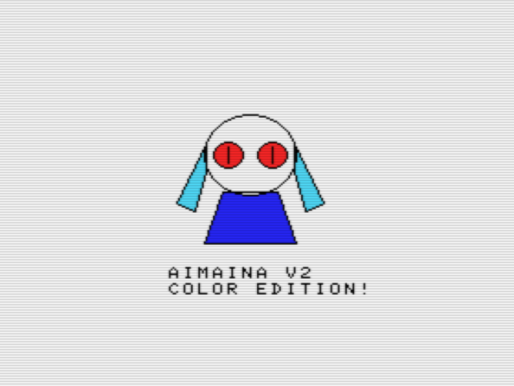

# AIMAINA-V2

## これは何？

ソースコードのDATA行が空の状態で「Gemini 3.1 Pro」に「AIMAINA.BASを解析して、添付した画像を元にDATAを作り変えて。」と指示して生成したコード。DATA以外は自作のコードです。

AIに見せた画像

## 使い方
1. AIMAINA.BASファイルをフロッピーディスクイメージにコピーしてください。
2. openMSX等のでMSXを起動。
3. `RUN "AIMAINA.BAS"`等を実行。

## 必要環境
- MSX（恐らく全てのMSXで動きます）

## ライセンス

**MIT License** で公開しています。  
ご自由に使って、改変して、参考にしてください。  
ただし**自作発言はNG**でお願いします。
